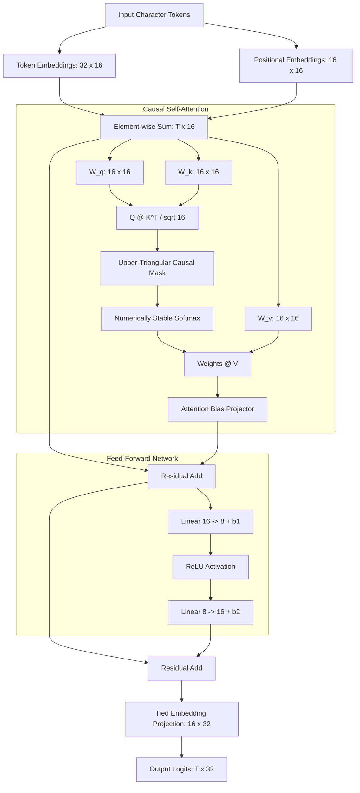

# Mimo AI 🧠
### 1,824-Parameter Neural Engine from Mathematical First Principles in Pure NumPy
*Zero PyTorch. Zero TensorFlow. 100% Connected Computational Autograd Graph.*

[](LICENSE)
[](https://www.python.org/)
[](https://numpy.org/)
[](#parameter-budget-breakdown)

---

## 📌 Overview

**Mimo AI** is an autoregressive decoder-only Transformer built entirely from scratch in pure Python and NumPy. Developed as an exploration into the fundamental mechanics of self-attention, backpropagation, and token dynamics, it proves that language models can be understood and trained without relying on high-level frameworks like PyTorch or HuggingFace.

Every single matrix multiplication, scaled dot-product attention score, causal mask, and gradient update is explicitly tracked on an analytical computational graph with custom reverse-mode automatic differentiation (**Autograd**).


---

## 🏛️ System Architecture



---

## 📐 Parameter Budget Breakdown

The architecture adheres strictly to an analytical budget of **1,824 parameters**:

| Layer / Tensor | Shape | Parameter Count | Mathematical Role |
| :--- | :--- | :--- | :--- |
| **Token Embeddings** | `(32, 16)` | **512** | Continuous vector representations for 32 ASCII characters |
| **Positional Embeddings** | `(16, 16)` | **256** | Absolute temporal positional encoding for context window $T = 16$ |
| **Query Projection ($W_q$)** | `(16, 16)` | **256** | Attention query linear projection |
| **Key Projection ($W_k$)** | `(16, 16)` | **256** | Attention key linear projection |
| **Value Projection ($W_v$)** | `(16, 16)` | **256** | Attention value linear projection |
| **FFN Expansion ($W_1$)** | `(16, 8)` | **128** | Feed-forward bottleneck projection |
| **FFN Bias ($b_1$)** | `(1, 8)` | **8** | First layer linear bias |
| **FFN Projection ($W_2$)** | `(8, 16)` | **128** | Feed-forward recovery projection |
| **FFN Bias ($b_2$)** | `(1, 16)` | **16** | Second layer linear bias |
| **Attention Bias ($a_{\text{bias}}$)** | `(1, 8)` | **8** | Learnable subspace attention bias |
| **Total Parameters** | — | **1,824** | **100% Differentiable & Audited** |

---

## 🔬 Mathematical Highlights

1. **Custom Reverse-Mode Autograd:**
   Every tensor maintains a directed acyclic graph (DAG) of operations with explicit backward gradient closures:
   $$\frac{\partial \mathcal{L}}{\partial A} = \frac{\partial \mathcal{L}}{\partial C} \cdot B^T, \quad \frac{\partial \mathcal{L}}{\partial B} = A^T \cdot \frac{\partial \mathcal{L}}{\partial C}$$
2. **Numerically Stable Softmax:**
   Mitigates IEEE 754 floating-point overflow using max-subtraction:
   $$\text{Softmax}(z_i) = \frac{e^{z_i - \max(z)}}{\sum_j e^{z_j - \max(z)}}$$
3. **First-Principles Adam Optimizer:**
   Tracks running first ($m_t$) and second ($v_t$) raw moments with analytical bias correction:
   $$\hat{m}_t = \frac{m_t}{1 - \beta_1^t}, \quad \hat{v}_t = \frac{v_t}{1 - \beta_2^t}, \quad \theta_{t} = \theta_{t-1} - \frac{\eta}{\sqrt{\hat{v}_t} + \epsilon} \hat{m}_t$$

---

## 🚀 Quick Start

### 1. Verify Parameter Budget
```bash
python param_audit.py
```

### 2. Run Forward Pass & Generation Demo
```bash
python demo.py
```

---

<div align="center">
  <b>Architected by MD. Raisul Islam Mobin</b> • <a href="https://mobin.tech">mobin.tech</a>
</div>
